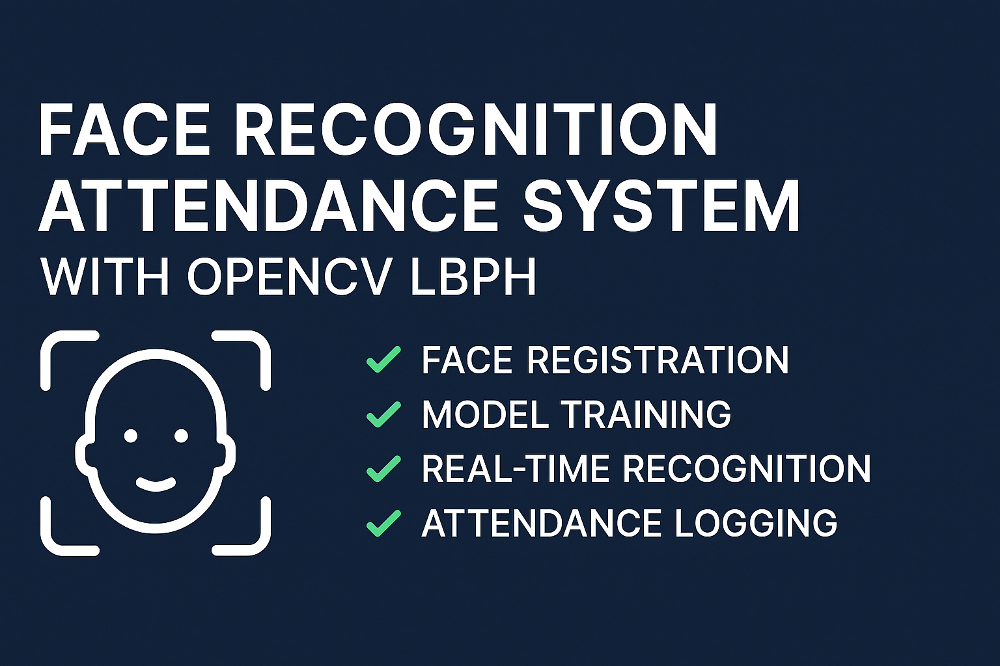

# Face Recognition Attendance System (OpenCV)



A Python-based **Face Recognition Attendance System** using **OpenCV LBPH** that captures, trains, and recognizes faces in real-time to mark attendance automatically.  
This project works fully offline — no dlib, no internet, no complex libraries.

---

## 👨‍💻 Creator  
**Yuvraj Singh**

---

## 📌 Features

### ✔ Face Registration  
- Capture face dataset using a webcam  
- Assign a numeric ID + name  
- Saves dataset automatically  

### ✔ Model Training  
- Uses **LBPH algorithm**  
- Saves trained model to `trainer.yml`

### ✔ Real-Time Recognition  
- Detects and identifies faces live  
- Shows name + confidence score  
- Works for multiple people at once  

### ✔ Attendance Logging  
- Saves name, time, and date  
- Prevents duplicate entries  

---

# 🖼️ Project Banner

> Add your own banner here  
> Create a folder named `assets/` inside your GitHub repo  
> Put your banner image as:
```
assets/banner.png
```

---

# 📸 Screenshots

> Create `assets/screenshots/` folder and add your images.

### 📷 1. Face Registration  
`assets/screenshots/register.png`

### 📷 2. Model Training  
`assets/screenshots/training.png`

### 📷 3. Real-Time Recognition  
`assets/screenshots/recognition.png`

### 📷 4. Attendance CSV Output  
`assets/screenshots/attendance.png`

---

# 📂 Project Structure

```
FaceAttendance/
│
├── main.py
├── dataset/
├── trainer.yml
├── labels.csv
├── Attendance.csv
├── assets/
│   ├── banner.png
│   └── screenshots/
│       ├── register.png
│       ├── training.png
│       ├── recognition.png
│       └── attendance.png
└── README.md
```

---

## 🧑‍🏫 Tips for Best Accuracy

- Capture 20–30 images per person  
- Use good lighting  
- Keep face centered  
- Avoid multiple faces during registration  

---

## ❤️ Credits  
Created by **Yuvraj Singh**
